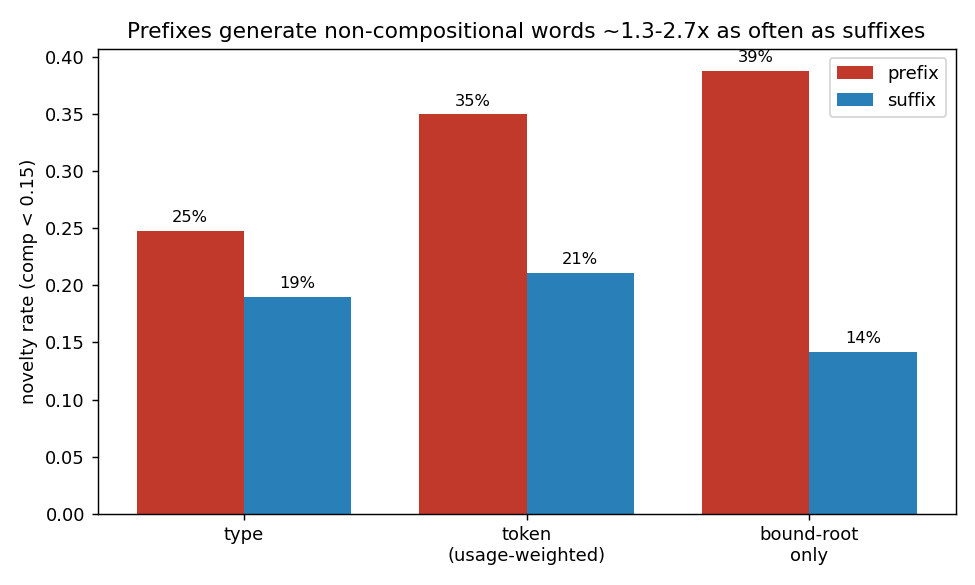
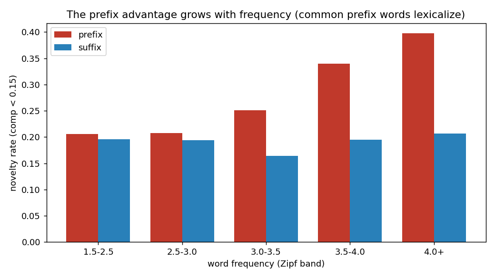

# Do English prefixes generate "new words" more than suffixes do?

When you bolt an affix onto a root, sometimes the result stays transparent
(`rerun` is just "run again") and sometimes it drifts into a meaning you could
never predict from the parts. `remember` began as roughly re + member ("bring
the members back together") and is now purely about memory. `business` is no
longer "the state of being busy."

This project asks one question and answers it quantitatively:

> **Are prefixes more likely than suffixes to produce words whose meaning has
> become independent of their parts?**

**Short answer: yes, robustly, by a factor of about 1.3x to 2.7x depending on
how you count.** And the effect is concentrated in common words, which is the
fingerprint of lexicalization.



> **Extended study.** This README documents the original English analysis. The
> project was later reframed around two competing accounts of the asymmetry, a
> **serial-position** account (the first morpheme you traverse is the retrieval
> anchor) and a **grammatical-function** account, and extended with further tests:
> robustness across embeddings, a diachronic test, four Romance languages, Arabic
> and agglutinative languages, and a language-model probe with a bidirectional
> control. Two of those tests constrain the explanation: a diminutive
> counterexample favors grammatical function over position, and a BERT-vs-GPT-2
> control shows the language-model asymmetry is distributional, not a product of
> autoregressive processing. See **[PAPER.md](PAPER.md)** for the short paper
> draft, **[notes.md](notes.md)** for the full research log including dead ends and
> reversals, and **[LITERATURE.md](LITERATURE.md)** for the novelty assessment and
> closest prior work.

| measure | prefix | suffix |
|---|---|---|
| words analyzed (distinct lexemes) | 1,658 | 7,053 |
| **type-level novelty** (each word once) | **24.8%** | **19.0%** |
| **token-level novelty** (weighted by how often people use the word) | **35.0%** | **21.1%** |
| **bound-root words only** (receive, conceive, reduce, ...) | **38.8%** | **14.2%** |
| mean compositionality (higher = more predictable) | +0.264 | +0.325 |

Difference in the compositionality distribution is not subtle
(Mann-Whitney U, p ≈ 2e-31).

## What "novelty" means here, precisely

A word is "novel" when its meaning is **not predictable from affix + root**.
We measure that distributionally. For each affixed word we compute

```
compositionality(word) = cosine( vec(word),  affix_offset(affix) + root_meaning )
```

- `vec(word)` is a word-level GloVe embedding (Wikipedia + Gigaword, 400k vocab).
- `affix_offset(affix)` is the *typical* semantic shift that affix imparts,
  learned from that affix's own transparent words (two-pass, self-cleaning, so
  drifted outliers do not poison the offset). It is the same vector-analogy idea
  as `king - man + woman = queen`.
- `root_meaning` is `vec(root)` for an ordinary free root, or, for a **bound
  root** that has no standalone vector (`-ceive`, `-duct`, `-tain`, `-sume`),
  it is reconstructed from the root's morphological family, leave-one-out, so a
  word is never used to predict itself.

High compositionality means the word lands where affix + root predicts
(transparent). Low compositionality means it does not (novel / drifted). We call
a word "novel" below a cosine of 0.15, but nothing hinges on that cut: the full
distributions and the rank test tell the same story (see `fig1_distributions.png`).

### Why not just compare the word to its root directly?

Because raw word-vs-root cosine measures *topic* drift, not *semantic* drift. A
TV `rerun` appears in different contexts than jogging `run`, so it scores far
from `run` despite being perfectly compositional. We checked this explicitly:
raw cosine put `remember`/`member` (0.11) and `rerun`/`run` (0.11) at the same
distance, which is useless. The affix-offset correction is what separates them.
We also deliberately avoid subword/fastText vectors, which would make `remember`
and `member` look similar just from shared letters.

## Why this is the answer you would expect

English **suffixes** are mostly class-changing and grammatically productive:
`-ness`, `-ment`, `-ity`, `-able`, `-ize` do a regular, predictable job, so they
stay compositional. English **prefixes** are mostly class-maintaining semantic
modifiers, and a large share entered the language as Latinate borrowings that
were *already* lexicalized (`remember` arrived whole from Latin `rememorari`; it
was never assembled in English). The bound-root prefix families are the clearest
case: `receive`, `perceive`, `conceive`, `deceive` share `-ceive` but mean wildly
different things, so the family does not cohere and each member reads as novel.

The frequency breakdown sharpens the interpretation. In the rarest band prefixes
and suffixes are nearly equal (20.5% vs 19.5%); the prefix advantage grows with
frequency (39.7% vs 20.7% in the most common band). Rare affixed words are about
equally transparent on both sides. What differs is that **common prefixed words
lexicalize**, which is exactly the `remember` story.



## A few concrete families

```
-ceive : receive(-0.11)  deceive(+0.15)  conceive(+0.18)
-duct  : traduce(-0.11)  deduct(+0.18)   conduct(+0.19)  reduce(+0.25)  induce(+0.32)
-tain  : entertain(+0.10) contain(+0.18) detain(+0.24)   retain(+0.28)
prefix : congress, inmate, arose, amount, inspect, prefect, predict, bespeak
suffix : business-type drift is rarer; the most-drifted suffix is agentive -er
         (comer, jobber, speaker) and lexicalized -ment (secondment, vestment)
```

(numbers are compositionality; lower = more drifted. Note the metric scores
drift *relative to the family consensus*, so a word can read as transparent if
its whole family drifted together.)

## Reproduce it

```bash
python3 -m venv .venv && . .venv/bin/activate
pip install -r requirements.txt
./fetch_data.sh                 # downloads MorphoLEX (~7 MB) from its GitHub repo
python affix_morpholex.py       # main analysis -> results_morpholex.csv (+ console tables)
python figures.py               # -> fig1/2/3 .png, stats.json
```

First run downloads GloVe vectors (~376 MB, cached by gensim afterward).
`affix_orthographic.py` is the earlier, weaker baseline that decomposes words by
string matching instead of validated morphology; it is kept for comparison and
to show why validated segmentation matters (string matching mislabels
`color = co+lor`, `surgery = ery+surge`).

## Honest limitations

1. **Synchronic, not diachronic.** We measure that prefixed words *are* more
   non-compositional today. We do not directly observe the historical process of
   meaning drift; "generates new words" is an inference from the snapshot.
2. **Distributional proxy.** Embeddings conflate meaning with topic/register.
   The offset correction removes the systematic part, but per-word scores are
   noisy. Trust the population comparison, not any single word.
3. **The bound-root metric scores drift relative to the family,** which is a
   slightly stricter notion than "drift from the literal parts." A uniformly
   drifted family looks compositional under it.
4. **We inherit MorphoLEX's segmentation choices** (it treats `remember` and
   `business` as monomorphemic, for instance) and restrict to single-affix,
   single-root words for a clean contrast.
5. **English only, one corpus** (GloVe trained on Wikipedia + Gigaword).
6. The prefix and suffix samples differ in size (suffixation is far more
   productive); we compare rates and use a rank test, so this is handled, but it
   is worth stating.

## Data and credits

- Morphology: **MorphoLEX** (Sanchez-Gutierrez, Mailhot, Deacon & Wilson, 2018),
  *Behavior Research Methods*. https://github.com/hugomailhot/MorphoLex-en
  (please check that repository's license before redistributing the data file).
- Vectors: **GloVe** Wikipedia + Gigaword 300d (Pennington, Socher & Manning, 2014).
- Frequencies: the **wordfreq** Python package.

Analysis and write-up by Kevin Edey.
